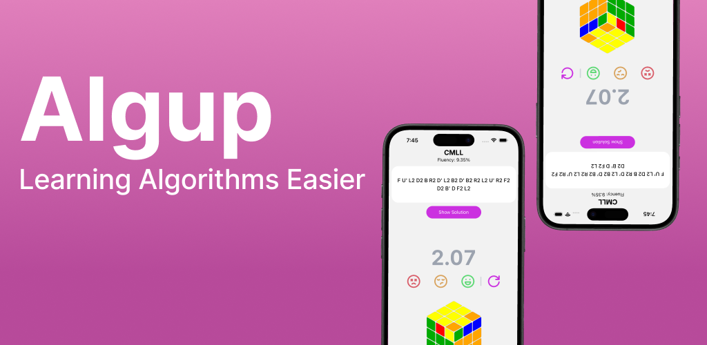

<a id="readme-top"></a>

<!-- PROJECT LOGO -->
<br />
<div align="center">
  <h1 align="center">Algup</h1>

  <p align="center">
    A mobile flashcard-based app to build confidence in your cubing algorithms
  </p>



<a href="https://play.google.com/store/apps/details?id=com.algup.cubealgtrainer&pcampaignid=web_share" target="_blank">Play Store Link</a>

</div>
<!-- GETTING STARTED -->

## Getting Started

### Prerequisites

To run this project, you'll need node/npm installed on your device. Visit the following links to download these.

- <a href = "https://nodejs.org/en/download"> Node / npm</a>

### Installation

_Below are instructions for how you can clone and run a development build of the project._

1. Clone the repo with

   ```sh
   git clone https://github.com/dwyaneramos/algup.git
   ```

#### Frontend / Mobile App

1. Enter the project

   ```sh
   cd algup/
   ```

2. Install NPM packages

   ```sh
   npm install
   ```

3. Run the dev environment

   ```sh
   npx expo start
   ```
